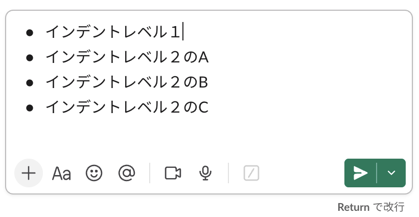
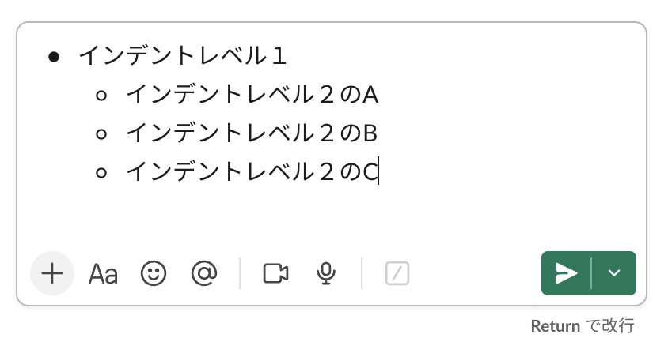

# 目的

Google Docsの箇条書きをSlackにコピーするツール

## 解決した課題

Google Docsの箇条書きをMacのクリップボードにコピーしてSlackにペーストすると、以下のように箇条書きが崩れてしまう。

例えば、このようなGoogle Docsの箇条書き


これをSlackにコピーすると



とフラットな箇条書きでコピーされてしまう

### このツールを使うと

インデントの構造を保持してコピーできます！




## インストール方法

### 実行プログラムのダウンロード
Apple siliconのMacOS(M1,M2など)であれば、 [こちらの実行ファイル](https://raw.githubusercontent.com/fetaro/gdocs_to_slack/main/dist/arm64/gdocs_to_slack) をダウンロードしてください。
Intell Macの場合は、[こちらの実行ファイル](https://raw.githubusercontent.com/fetaro/gdocs_to_slack/main/dist/x86_64/gdocs_to_slack) をダウンロードしてください。
### 実行権限の付与
Macのターミナルを開いて、ダウンロードしたファイルに対して以下のコマンドを実行し実行権限を与えてください。

```bash
chmod 755 ./gdocs_to_slack
```

## 使い方

1. Google Docsの箇条書きをコピーします

2. クリップボードにGoogle Docsの箇条書きがある状態で以下のコマンドを実行します

```bash
./gdocs_to_slack
```

これでSlackに貼り付け可能なデータがクリップボードに書き込まれました

3. Slackにてペーストします

### (オプション)テキストとしてペーストする場合

`-t` オプションでmarkdown形式のテキストとしてペーストすることも可能です

```bash
./gdocs_to_slack -t
```

以下のようなテキストがクリップボードに保存されます

```
- インデントレベル１
    - インデントレベル２のA
    - インデントレベル２のB
    - インデントレベル２のC
```

### デバッグ

`-d` オプションを付けるとデバッグモードになります

```bash
./gdocs_to_slack -d
```

## 開発者用

[FOR_DEVELOPER.md](FOR_DEVELOPER.md) を参照してください。
